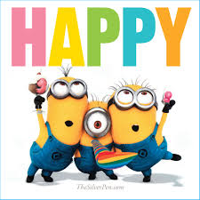

# Applied Data Science @ Columbia
## Spring 2019
## Project 1: What made you happy today?



### [Project Description](doc/Proj1_desc.md)
This is the first and only *individual* (as opposed to *team*) this semester. 

Term: Spring 2019

+ Projec title: Clap along If You Know What Happiness Is to You -- How Different Groups of People Feel Happy?
+ This project is conducted by Zixiao Wang (zw2513)

+ Project summary: As the song "Happy" by Pharrell Williams goes, "clap along if you know what happiness is to you". People could be happy for different reasons. However, do people realize what made them happy today? To figure this out, I conduct a brief study on the reasons that made people feel happy based on the dataset HappyDB. In general, this study involved some techniques of text mining, analyzing keywords and sentiments of the data file. The result shows that people's happiness concentrates more achievement and affection and there is a difference between males and females as well as single and married people.

Following [suggestions](http://nicercode.github.io/blog/2013-04-05-projects/) by [RICH FITZJOHN](http://nicercode.github.io/about/#Team) (@richfitz). This folder is orgarnized as follows.

```
proj/
├── data/
├── doc/
├── figs/
├── lib/
└── output/
```

Please see each subfolder for a README file.
