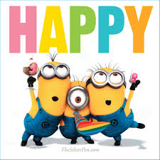

```{r setup, include=FALSE}
knitr::opts_chunk$set(echo = TRUE)
```

#

As the song "Happy" by Pharrell Williams goes, "clap along if you know what happiness is to you". People could be happy for different reasons. However, do people realize what made them happy today? To figure this out, I investigated the happy moment of people who have different genders, marital status on different categories. A research about happiness analysis follows. 

```{r load libraries, warning=FALSE, message=FALSE, echo=FALSE}
# Step 0 - Load all the required libraries

library(tm)
library(tidytext)
library(tidyverse)
library(DT)
library(scales)
library(wordcloud)
library(wordcloud2)
library(gridExtra)
library(ngram)
library(widyr)
library(ggplot2)
library(igraph)
library(ggraph)
library(dplyr)
library(tidyr)
```

First step for the project is to preprocessing data, which would be able to use for further analysis. (The process was done in the other rmd file named "Text_Processing" and the output was saved in the output file, which could be used directly.)

```{r, warning=FALSE, message=FALSE, echo=FALSE}
# Introduce demo_data, combine with hm_data keep the required columns for analysis
hm_data <- read_csv("../output/processed_moments.csv")

urlfile <- 'https://raw.githubusercontent.com/rit-public/HappyDB/master/happydb/data/demographic.csv'
demo_data <- read_csv(urlfile)

hm_data <- hm_data %>%
  inner_join(demo_data, by = "wid") %>%
  select(wid,
         original_hm,
         gender, 
         marital, 
         parenthood,
         reflection_period,
         age, 
         country, 
         ground_truth_category,
         predicted_category,
         text) %>%
  mutate(count = sapply(hm_data$text, wordcount)) %>%
  filter(gender %in% c("m", "f")) %>%
  filter(marital %in% c("single", "married")) %>%
  filter(parenthood %in% c("n", "y")) %>%
  filter(reflection_period %in% c("24h", "3m")) %>%
  mutate(reflection_period = fct_recode(reflection_period, 
                                        months_3 = "3m", hours_24 = "24h"))
```

After looking into data, I found that there are some observations do not make any sense (for example, there are 51 people who have age 233.0) for study use. Thus, I removed those data.

```{r cleaning data, warning=FALSE, message=FALSE, echo=FALSE}
hm_data <- hm_data[-c(which(as.numeric(hm_data$age)>120),
                 which(hm_data$age=="prefer not to say")),]
```

## Overall Data Exploration on Categories of Happiness

After preprocessing data, what makes people happy? I started the research with overall data exploration on categories of happiness. Thus, I generate a wordcloud which gives the most popular words that make people feel happy.

```{r, warning=FALSE, message=FALSE, echo=FALSE}
bag_of_words <-  hm_data %>%
  unnest_tokens(word, text)
word_count <- bag_of_words %>%
  dplyr::count(word, sort = TRUE)

# Produce a word cloud to get the first feeling of what makes different groups of people happy
wordcloud2(data = word_count[1:100,], shape = 'pentagon', size = 0.6, backgroundColor = "lightblue" )
```

From the keywords, "friend", "family" and some words describe entertainment such as "watched" showed a higher popularity. They seem to belong different categories which could make people happy. Thus, I chose to seperate data by category, which would show the main reason that makes people happy. I drew a pie chart and a frequency histogram, which showed the proportion and the number of each category.

```{r, warning=FALSE, message=FALSE, echo=FALSE}
weight_category<-data.frame(lb=c("achievement", "affection", "bonding", "enjoy_the_moment","leisure","nature","exercise"),dt=c(sum(hm_data$predicted_category=="achievement")/nrow(hm_data), sum(hm_data$predicted_category=="affection")/nrow(hm_data), sum(hm_data$predicted_category=="bonding")/nrow(hm_data), sum(hm_data$predicted_category=="enjoy_the_moment")/nrow(hm_data), sum(hm_data$predicted_category=="leisure")/nrow(hm_data), sum(hm_data$predicted_category=="nature")/nrow(hm_data), sum(hm_data$predicted_category=="exercise")/nrow(hm_data)))
labels1 <- paste(weight_category$lb, round(weight_category$dt*100, digits = 2)) # add percents to labels 
labels1 <- paste(labels1, "%", sep="") # ad % to labels 
pie(weight_category$dt, labels = labels1, main="Weight of Happiness Categories", col = c("yellow","lightblue","red","green","purple","white","blue"))

freq.df <- count(hm_data, predicted_categories = hm_data$predicted_category)
ggplot(freq.df, aes(predicted_categories, n)) +
  geom_histogram(stat="identity", color="black", fill="light blue") +
  labs(x="happiness category", y="frequency", title="The Frequency of the 7 Happiness Categories of Happiness") +
  geom_text(aes(x=predicted_categories, y=freq.df$n, label=freq.df$n, vjust=-0.5)) 
```

According to the results, we got more HappyDB data from category achievement and affection much more than other category, and there is no huge disparity between the two categories (achievement and affection). So in further study, we can regard them as half-to-half roughly, thus our analysis can go on without big deviation from sampling, the idea is the same for gender and marital status.

## Gender

```{r, warning=FALSE, message=FALSE, echo=FALSE}
par(mfrow=c(2,4))

achievement_group <- hm_data[hm_data$predicted_category == "achievement","gender"]
gender1 <- as.numeric(achievement_group$gender == "m")
gender_of_achievement <- data.frame(gender_label=c("male","female"),
gender_count <- c(sum(gender1==1)/nrow(achievement_group),
sum(gender1==0)/nrow(achievement_group)))
pct <- round(gender_of_achievement$gender_count*100)
labels <- paste(gender_of_achievement$gender_label, pct) # add percents to labels 
labels <- paste(labels, "%", sep = "") # ad % to labels 
pie(gender_of_achievement$gender_count,labels = labels, main = "Achievement By Gender", radius = 0.8)

affection_group <- hm_data[hm_data$predicted_category == "affection","gender"]
gender2 <- as.numeric(affection_group$gender == "m")
gender_of_affection <- data.frame(gender_label=c("male","female"),
gender_count <- c(sum(gender2==1)/nrow(affection_group),
sum(gender2==0)/nrow(affection_group)))
pct <- round(gender_of_affection$gender_count*100)
labels <- paste(gender_of_affection$gender_label, pct) # add percents to labels 
labels <- paste(labels, "%", sep = "") # ad % to labels 
pie(gender_of_affection$gender_count,labels = labels, main = "Affection By Gender", radius = 0.8)

bonding_group <- hm_data[hm_data$predicted_category == "bonding","gender"]
gender3 <- as.numeric(bonding_group$gender == "m")
gender_of_bonding <- data.frame(gender_label=c("male","female"),
gender_count <- c(sum(gender3==1)/nrow(bonding_group),
sum(gender3==0)/nrow(bonding_group)))
pct <- round(gender_of_bonding$gender_count*100)
labels <- paste(gender_of_bonding$gender_label, pct) # add percents to labels 
labels <- paste(labels, "%", sep = "") # ad % to labels 
pie(gender_of_bonding$gender_count,labels = labels, main = "Bonding By Gender", radius = 0.8)

enjoy_the_moment_group <- hm_data[hm_data$predicted_category == "enjoy_the_moment","gender"]
gender4 <- as.numeric(enjoy_the_moment_group$gender == "m")
gender_of_enjoy_the_moment <- data.frame(gender_label=c("male","female"),
gender_count <- c(sum(gender4==1)/nrow(enjoy_the_moment_group),
sum(gender4==0)/nrow(enjoy_the_moment_group)))
pct <- round(gender_of_enjoy_the_moment$gender_count*100)
labels <- paste(gender_of_enjoy_the_moment$gender_label, pct) # add percents to labels 
labels <- paste(labels, "%", sep = "") # ad % to labels 
pie(gender_of_enjoy_the_moment$gender_count,labels = labels, main = "Enjoy the Moment By Gender", radius = 0.8)

leisure_group <- hm_data[hm_data$predicted_category == "leisure","gender"]
gender5 <- as.numeric(leisure_group$gender == "m")
gender_of_leisure <- data.frame(gender_label=c("male","female"),
gender_count <- c(sum(gender5==1)/nrow(leisure_group),
sum(gender5==0)/nrow(leisure_group)))
pct <- round(gender_of_leisure$gender_count*100)
labels <- paste(gender_of_leisure$gender_label, pct) # add percents to labels 
labels <- paste(labels, "%", sep = "") # ad % to labels 
pie(gender_of_leisure$gender_count,labels = labels, main = "Leisure By Gender", radius = 0.8)

nature_group <- hm_data[hm_data$predicted_category == "nature","gender"]
gender6 <- as.numeric(nature_group$gender == "m")
gender_of_nature <- data.frame(gender_label=c("male","female"),
gender_count <- c(sum(gender6==1)/nrow(nature_group),
sum(gender6==0)/nrow(nature_group)))
pct <- round(gender_of_nature$gender_count*100)
labels <- paste(gender_of_nature$gender_label, pct) # add percents to labels 
labels <- paste(labels, "%", sep = "") # ad % to labels 
pie(gender_of_nature$gender_count,labels = labels, main = "Nature By Gender", radius = 0.8)

exercise_group <- hm_data[hm_data$predicted_category == "exercise","gender"]
gender7 <- as.numeric(exercise_group$gender == "m")
gender_of_exercise <- data.frame(gender_label=c("male","female"),
gender_count <- c(sum(gender7==1)/nrow(exercise_group),
sum(gender7==0)/nrow(exercise_group)))
pct <- round(gender_of_exercise$gender_count*100)
labels <- paste(gender_of_exercise$gender_label, pct) # add percents to labels 
labels <- paste(labels, "%", sep = "") # ad % to labels 
pie(gender_of_exercise$gender_count,labels = labels, main = "Exercise By Gender", radius = 0.8)
```

By studying each category grouped by gender, we can see that compared with other categories, nature and affection seem to be the categories that does not make great difference between males and females because the proportion in these two categories are almost equally divided. Note that the total number of females is much less than the total number of males in the dataset hm_data, which means that in these two categories, it would be more likely that females will be happy because of affection or nature, or we can say that female put more emphasis on their emotions. On the contrary, among the group of exercise or even the group of achievement, males have a much larger proportion, which means that people who are happy because of exercise or achievement, male could be much easier to find happiness. That is similar to the stereotype of the traditional feeling of females and males.

To further study the difference between males and females, we plot the word frequency to show the difference between males and females on achievement and affection.

```{r, warning=FALSE, message=FALSE, echo=FALSE}
bag_of_words_achievement <- bag_of_words[bag_of_words$predicted_category == "achievement",]
bag_of_words_affection <- bag_of_words[bag_of_words$predicted_category == "affection",]

word_count_achievement <- bag_of_words_achievement %>%
  dplyr::count(word, sort = TRUE)
word_count_affection <- bag_of_words_affection %>%
  dplyr::count(word, sort = TRUE)
```

```{r, warning=FALSE, message=FALSE, echo=FALSE}
frequency_achievement <- bag_of_words_achievement %>% 
  group_by(gender) %>% 
  dplyr::count(word, sort = TRUE) %>% 
  left_join(bag_of_words_achievement %>% 
              group_by(gender) %>% 
              summarise(total = n())) %>%
  mutate(freq = n/total)
frequency_achievement<- frequency_achievement %>% 
  select(gender, word, freq) %>% 
  spread(gender, freq) %>%
  arrange(f,m)
ggplot(frequency_achievement, aes(f,m)) +
  geom_jitter(alpha = 0.1,color= "skyblue", size = 2, width = 0.2, height = 0.2) +
  labs(title="Word Frequency for Female and Male (Achievement)", x="Female", y="Male")+
  geom_text(aes(label = word), check_overlap = TRUE, vjust = 1.5) +
  scale_x_log10(labels = percent_format()) +
  scale_y_log10(labels = percent_format()) +
  geom_abline(color = "navy")
```

As we can see from the word frequency plot, achievement for males and females shows some differences. For example, males would show higher happiness from "basketball", "bike" or "golf", which belong to competition, while females are easier to be happy as a result of their appearance such as "dress", "clothes" and "bag". 

```{r, warning=FALSE, message=FALSE, echo=FALSE}
frequency_affection <- bag_of_words_affection %>% 
  group_by(gender) %>% 
  dplyr::count(word, sort = TRUE) %>% 
  left_join(bag_of_words_affection %>% 
              group_by(gender) %>% 
              summarise(total = n())) %>%
  mutate(freq = n/total)
frequency_affection <- frequency_affection %>% 
  select(gender, word, freq) %>% 
  spread(gender, freq) %>%
  arrange(f,m)
ggplot(frequency_affection, aes(f,m)) +
  geom_jitter(alpha = 0.1,color= "orangered", size = 2, width = 0.2, height = 0.2) +
  labs(title="Word Frequency for Female and Male (Affection)", x="Female", y="Male")+
  geom_text(aes(label = word), check_overlap = TRUE, vjust = 1.5) +
  scale_x_log10(labels = percent_format()) +
  scale_y_log10(labels = percent_format()) +
  geom_abline(color = "black")
```

For affection, both groups show a very high concentration on family or relationship, such as words "family", "wife", "husband".

## Marital Status

Besides gender, marriage might also be another important factor which could influence the reason that makes people feel happy.

```{r, warning=FALSE, message=FALSE, echo=FALSE}
bag_of_words_single <- bag_of_words[bag_of_words$marital=="single",]
bag_of_words_married <- bag_of_words[bag_of_words$marital=="married",]

word_count_single <- bag_of_words_single %>%
  dplyr::count(word, sort = TRUE)
word_count_married <- bag_of_words_married %>%
  dplyr::count(word, sort = TRUE)

wordcloud(words = word_count_single$word[1:100],
          freq = word_count_single$n[1:100],
          random.order=FALSE,colors=brewer.pal(8, "Set1"))
```

```{r, warning=FALSE, message=FALSE, echo=FALSE}
wordcloud(words = word_count_married$word[1:100],
          freq = word_count_married$n[1:100],
          random.order=FALSE,colors=brewer.pal(8, "Dark2"))
```

As we see from the wordcloud, the most popular words from single group are entertainment like "played", "watched" and "game". However, after marriage, people would pay more attention on their family using more words like "son", "daughter", "home" and etc.

To figure out more details about the key words for two groups, I studied the correlation between words, where I tried to use network analysis.

```{r, warning=FALSE, message=FALSE, echo=FALSE}
word_pair_single <- bag_of_words_single %>% 
  pairwise_count(word, wid, sort = TRUE, upper = FALSE)
word_pair_single[1:100,] %>%
  graph_from_data_frame() %>%
  ggraph(layout = "fr") +
  geom_edge_link(aes(edge_alpha = n, edge_width = n), edge_colour = "skyblue3") +
  geom_node_point(size = 3) +
  geom_node_text(aes(label = name), repel = TRUE,point.padding = unit(0.2, "lines")) +
  labs(title="Network for Single People")+
  theme_void()
```

```{r, warning=FALSE, message=FALSE, echo=FALSE}
word_pair_married <- bag_of_words_married %>% 
  pairwise_count(word, wid, sort = TRUE, upper = FALSE)
word_pair_married[1:100,] %>%
  graph_from_data_frame() %>%
  ggraph(layout = "fr") +
  geom_edge_link(aes(edge_alpha = n, edge_width = n), edge_colour = "red3") +
  geom_node_point(size = 3) +
  geom_node_text(aes(label = name), repel = TRUE,point.padding = unit(0.2, "lines")) +
  labs(title="Network for Married People")+
  theme_void()
```

As the results show, both groups (single and married) have a center "friend". However, after people get married, "friend" seems to be not the only center. Words connected to family such as "son", "daughter" also become centers. That shows that the hapiness of married people is getting complicated. In other words, the center of happiness for single is "friend" while married people could also be more willing to have happy memories with their family. 

To compare the two biggest categories (achievement and affection) which make people happy, I tried to compare their word usage.

```{r, warning=FALSE, message=FALSE, echo=FALSE}
word_ratios_single <- bag_of_words_single %>%
  count(word, predicted_category) %>%
  group_by(word) %>%
  filter(sum(n) >= 50) %>%
  ungroup() %>%
  spread(predicted_category, n, fill = 0) %>%
  mutate_if(is.numeric, funs((. + 1) / (sum(.) + 1))) %>%
  mutate(logratio = log(achievement /affection )) %>%
  arrange(desc(logratio))

word_ratios_single %>%
  group_by(logratio < 0) %>%
  top_n(15, abs(logratio)) %>%
  ungroup() %>%
  mutate(word = reorder(word, logratio)) %>%
  ggplot(aes(word, logratio, fill = logratio < 0)) +
  geom_col(alpha=0.8,show.legend = FALSE) +
  coord_flip() +
  labs(title="Word Usage for Single")+
  ylab("log ratio (achievement/affection)") +
  scale_fill_discrete(name = "", labels = c("achievement", "affection"))
```

From the bar plot above we can get that the main difference between achievement and affection for single. Some words will be used much more in affection, like "uncle", "mom", "sister", which is connected to family, while "bonus" and "feedback" would be higher used in achievement part.

```{r, warning=FALSE, message=FALSE, echo=FALSE}
word_ratios_married <- bag_of_words_married %>%
  count(word, predicted_category) %>%
  group_by(word) %>%
  filter(sum(n) >= 50) %>%
  ungroup() %>%
  spread(predicted_category, n, fill = 0) %>%
  mutate_if(is.numeric, funs((. + 1) / (sum(.) + 1))) %>%
  mutate(logratio = log(achievement /affection )) %>%
  arrange(desc(logratio))

word_ratios_married %>%
  group_by(logratio < 0) %>%
  top_n(15, abs(logratio)) %>%
  ungroup() %>%
  mutate(word = reorder(word, logratio)) %>%
  ggplot(aes(word, logratio, fill = logratio < 0)) +
  geom_col(alpha=0.8,show.legend = FALSE) +
  coord_flip() +
  labs(title="Word Usage for Married")+
  ylab("log ratio (achievement/affection)") +
  scale_fill_discrete(name = "", labels = c("achievement", "affection"))
```

For married people, family is still an important topic for affection part, even though achievement still has a large weight on career, words like "mturk" (which is a crowdsourcing Internet marketplace) became the most popular, which are more likely to help people work at home.

## Summary
To sum up, there are several observations of the study:

First, among 7 categories, it looks like people's happiness concentrates more on themes of achievement and affection.

For different genders, each category shows a divergence. For example, females are more likely to be happy because of affection including their emotions on family (husband) or relationship (boyfriend) and their appearance (clothes, dress). On the other hand, it might be more easier to be happy for males in their competition (basketball, won) or career (performance).

As for different marital status, married people seem to focus more on their family. Friendship is always a central topic, but after marriage, people also start to use more family connected words ("son", "daughter"). And even for the categories of achievement and affection, we can see a slight moving trend from career to family in one's achievement words that make people happy.

## References
1. https://github.com/rit-public/HappyDB