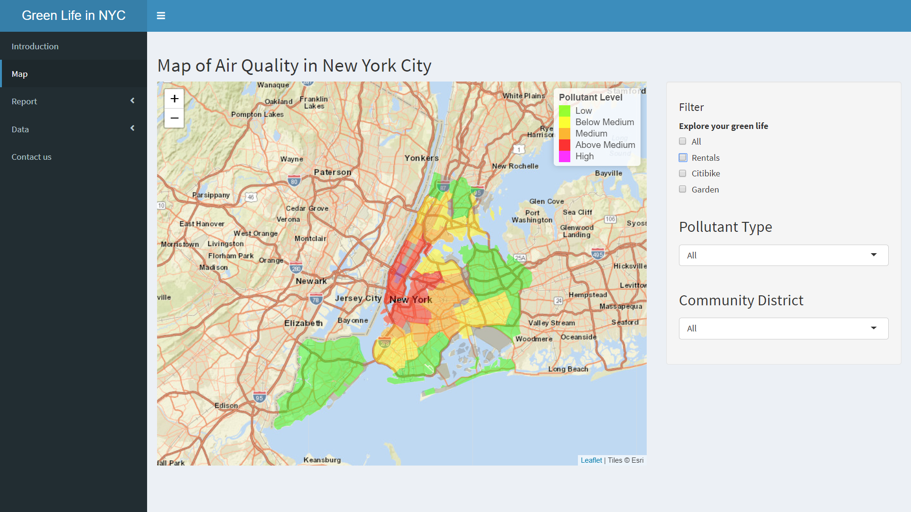

# Project 2: Shiny App Development Version 2.0

### [Project Description](doc/project2_desc.md)

In this second project of GR5243 Applied Data Science, we develop a version 2.0 of an *Exploratory Data Analysis and Visualization* shiny app on a topic of your choice using [NYC Open Data](https://opendata.cityofnewyork.us/) or U.S. government open data released on the [data.gov](https://data.gov/) website. See [Project 2 Description](doc/project2_desc.md) for more details.  

The **learning goals** for this project is:

- business intelligence for data science
- study legacy codes and further development
- data cleaning
- data visualization
- systems development/design life cycle
- shiny app/shiny server

*The above general statement about project 2 can be removed once you are finished with your project. It is optional.

## Project Title Green Life in NYC Version 2.0
Term: Spring 2019

+ Team #Group 5
+ **Projec title**: Live a Green Life in NYC—Shiny App Development Version 2.0
	+ Hu,Yiyao yh3076@columbia.edu
	+ Xia, Xin xx2295@columbia.edu
	+ Wang, Zixiao zw2513@columbia.edu
	+ Link to app:https://sheenxia.shinyapps.io/Greenlife/
	


+ **Project summary**: As a result of rapid industrialization, urbanization and motorization, daily air quality has become a big environmental issue. In response to the air pollution issue, having a green life is important and crucial. In this way, people should all be involved in the "green" activities, which help to reduce air pollution. Moreover, to live a green life, the living environment is also very important. One of the major developments of the app is adding a function on selecting people's favorite place to live where they can have their ideal air quality. Besides, our app provides all kinds of comparison graphs based on what you require, which would help you to make an easier decision on your living condition. Go ahead and live a green life in New York City!

+ **Contribution statement**: ([default](doc/a_note_on_contributions.md)) All team members contributed equally in all stages of this project. All team members approve our work presented in this GitHub repository including this contributions statement. 
+ Xia, Xin: Update and complete the shiny structure, contribute to Map and Report menu,create map for Rentals,Citibike and Garden,find and clean the datasets, update the github page.
+ Hu, Yiyao: Update the shiny structure, contribute to Map and Report menu, create Histogram plot ,Parcoords plot, Radar plot and Chart plot, find and clean the datasets,update the github page.
+ Wang, Zixiao: Update the shiny structure,contribute to Introduction, Map, Report,and Data menu, write articles,create Histogram plot and Radar plot,find and clean the datasets, update the github page, prepare for presentation.

+ **Data source**: 
	+ The Air quality dataset with map file can be found at [nyc.gov](http://a816-dohbesp.nyc.gov/IndicatorPublic/PublicTracking.aspx)
	+ The NYC Greenthumb Communicty Gardens can be found at [cityofnewyork.us](https://data.cityofnewyork.us/Environment/NYC-Greenthumb-Community-Gardens/ajxm-kzmj)
	+ The Citi Bike dataset can be found at [citibikenyc.com](https://www.citibikenyc.com/system-data)
	+ The Rentals dataset can be found at [coredata.nyc](http://app.coredata.nyc/?mlb=false&ntii=rent_asking_med&ntr=Community%20District&mz=14&vtl=https%3A%2F%2Fthefurmancenter.carto.com%2Fu%2Fnyufc%2Fapi%2Fv2%2Fviz%2F691a2b7c-94d7-46ac-ac4d-9a589cb2c6ed%2Fviz.json&mln=true&mlp=true&mlat=40.718&ptsb=&nty=2017&mb=roadmap&pf=%7B%22subsidies%22%3Atrue%7D&md=table&mlv=false&mlng=-73.996&btl=Borough&atp=neighborhoods#)

Following [suggestions](http://nicercode.github.io/blog/2013-04-05-projects/) by [RICH FITZJOHN](http://nicercode.github.io/about/#Team) (@richfitz). This folder is orgarnized as follows.


```
proj/
├── app/
├── lib/
├── data/
├── doc/
└── output/
```

Please see each subfolder for a README file.

