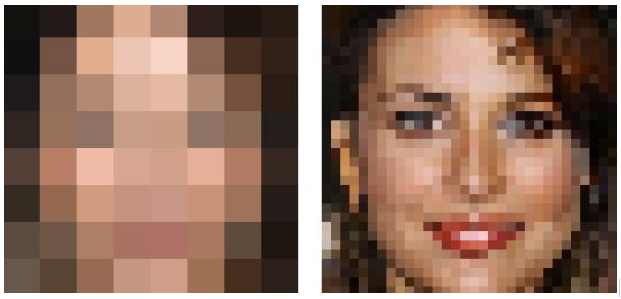

# Project: Can you unscramble a blurry image? 


### [Full Project Description](doc/project3_desc.md)

Term: Spring 2019

+ Team 11
+ Team members
	+ Sitong Liu (sl4460)
	+ Shuang Lu (sl4397)
	+ Zixiao Wang (zw2513)
	+ Hyunbin Yoo (hy2506)
	+ Yiyang Zeng (yz3403)

+ Project summary: In this project, we created a classification engine for enhancing the resolution of images. We created our baseline model using gradient boosting model(GBM), and the improved model using extreme gradient boosting model(XGB). To improve the effiency of XGB model, we have improved our cross validation part to train the model. Also, the main improvement of XGB model compared with baseline model is that XGB model has a much higher speed. 
	
+ **Contribution statement**:
	+ Zixiao Wang worked on the baseline model(GBM), including the implement of cross validation, feature and superResolution functions.
	+ Yiyang Zeng worked on XGB model construction, creating cross validation methodology on two parameters for XGB and making presentation. 
	+ Hyubin Yoo worked on attempting the SRCNN model in python. 
	+ Shuang Lu worked on XGB model construction, including cross validation(one parameter), feature and superResolution.
	+ Sitong Liu worked on improving XGB model, especially cross validation script, and attempting the SRCNN model in python. 

Following [suggestions](http://nicercode.github.io/blog/2013-04-05-projects/) by [RICH FITZJOHN](http://nicercode.github.io/about/#Team) (@richfitz). This folder is orgarnized as follows.

```
proj/
├── lib/
├── data/
├── doc/
├── figs/
└── output/
```

Please see each subfolder for a README file.
