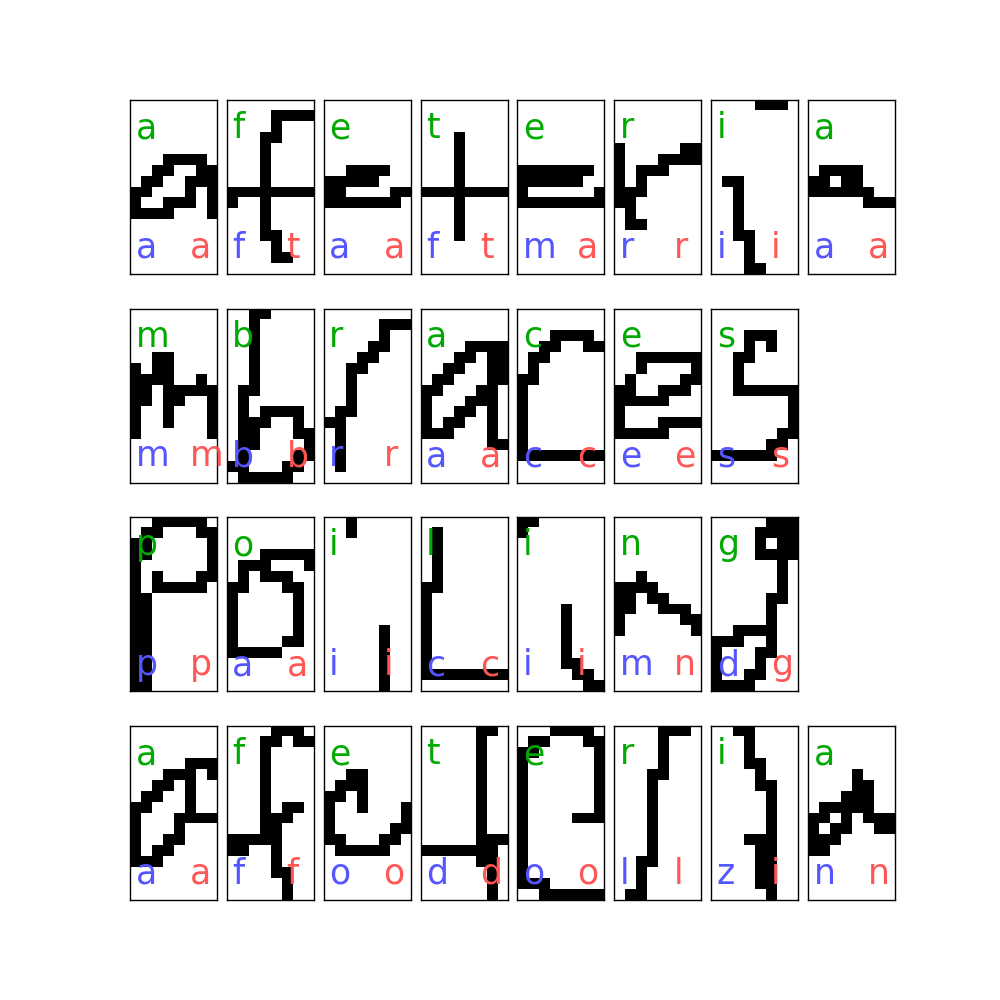

# Project: OCR (Optical Character Recognition) 



### [Full Project Description](doc/project4_desc.md)

Term: Spring 2019

**Team # 3**

**Team members:**
* **Dubova, Elena** ed2801@columbia.edu
* **Ren, Claire** xr2134@columbia.edu
* **Wang, Zixiao** zw2513@columbia.edu
* **Wu, Qianqian** qw2284@columbia.edu
* **Zhang, Zhicheng** zz2555@columbia.edu

**Project summary:**

In this project, we created an OCR post-processing procedure to enhance Tesseract OCR output. As the first step of post-processing we did **error detection** to identify incorrectly processed words. For that we use [Rule-based techniques](http://webpages.ursinus.edu/akontostathis/KulpKontostathisFinal.pdf), specifically rules are in the section 2.2. The code takes 100 documents, creates a single big corpus, which is splitted into two: one contains correct text elements, the other contains erroneous text elements. Only unique tokens are left for alanysis to reduce the amount of computation.To correct errors detected in the previous step, we followed the paper [Topic models](https://ieeexplore.ieee.org/stamp/stamp.jsp?tp=&arnumber=4377099). Error correction algorithm considered in the paper consists of two models: a topic model that provides information about word probabilities and OCR model that represents the probability of character errors. For each error word we compute a vector of candidates to substitute the erroneous word and pick the one that provides the best score according to the formula proposed in the paper. 
	
**Contribution statement**: ([default](doc/a_note_on_contributions.md)) All team members contributed equally to the project. Specifically, **Wang, Zixiao** and **Zhang, Zhicheng** were responsible for error detection and optimizing number of topics in LDA model, **Ren, Claire** and **Wu, Qianqian** were responsible for OCR confusion matrix that represents probabilities of character errors, **Dubova, Elena** was responsible for candidate list generation, LDA probability score computation. Everybody contributed to reproducibility testing and performance measurement. 

Following [suggestions](http://nicercode.github.io/blog/2013-04-05-projects/) by [RICH FITZJOHN](http://nicercode.github.io/about/#Team) (@richfitz). This folder is orgarnized as follows.

```
proj/
├── lib/
├── data/
├── doc/
├── figs/
└── output/
```

Please see each subfolder for a README file.
